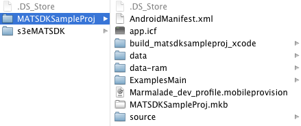
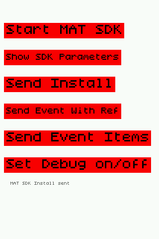

# MAT Marmalade Extension

The MobileAppTracking (MAT) extension for Marmalade provides basic application install
and event tracking functionality. To track installs, you must integrate the Marmalade 
edk extension with your Marmalade app. Once the SDK is integrated and set to track installs,
you can add and track additional events beyond an app install (such as purchases, game levels, and any other user engagement).

This document outlines the Marmalade SDK integration and use cases.

## Implementation

To use the Marmalade extension for the MAT SDK, you use the extension build provided in the plugin.
The sample project tests various methods of the MAT SDK either via the Android SDK or the iOS SDK.
The MAT Marmalade extension is built on top of the latest MAT SDKs (jar file for Android, static .a or library file for iOS).

In the .mkb config file of your project, you will need to include the /ios_android/s3eMATSDK/s3eMATSDK.mkf
file as a subproject to have access to the MAT SDK methods. If the s3eMATSDK.mkf file is in your project directory, add it to your .mkb with the line:

	subproject s3eMATSDK

Now that you have included the Marmalade MAT SDK, you can call the constructor, MATStartMobileAppTracker.
Choosing where to instantiate a new class is a decision that is unique to your application/code design,
but one example is to call it in an initialization function in IwMain() so that a MobileAppTracker is created as soon as the app is run.

Start the MobileAppTracker with a call to MATStartMobileAppTracker, passing in your MAT advertiser ID and key as params:

	MATStartMobileAppTracker("your_advertiser_id", "your_advertiser_key");

The “your_advertiser_id” and the “your_advertiser_key” values may be found on the “Tracking Code for XXXApp”
page by clicking on the “Download SDK” button and clicking on the appropriate mobile app.

## Platform Specific Settings

### Android

__Configure AndroidManifest.xml__

The SDK requires setting up a MobileAppTracker receiver in your Android manifest. Put this receiver inside your application tags.

__Install Referrer (Required):__

	<receiver android:name="com.mobileapptracker.Tracker" android:exported="true">
	   <intent-filter>
	       <action android:name="com.android.vending.INSTALL_REFERRER" />
	   </intent-filter>
	</receiver>

For more information on how MobileAppTracking uses the INSTALL_REFERRER, please see [How Google Play Install Referrer Works](http://support.mobileapptracking.com/entries/22561636-how-google-play-install-referrer-works).

If your app has multiple receivers for INSTALL_REFERRER, you will need to write a custom receiver that will call these receivers instead.
Learn how to [setup multiple Android install referrers](http://support.mobileapptracking.com/entries/23684142-Multiple-Android-Install-Referrers).

Before closing the manifest tag, add the following permissions in:

__a. Internet Permission (Required):__

Internet permission is required to connect to tracking servers.

	<uses-permission android:name="android.permission.INTERNET" />

__b. Offline Tracking Permission (Required):__

These permissions enable the SDK to queue tracking events while the user is not connected to the Internet.
Once the user is online, the SDK will process all queued events.

	<uses-permission android:name="android.permission.ACCESS_NETWORK_STATE" />

__c. Wifi State Permission (Required):__

These permissions enable the SDK to access information about whether you are connected to a Wi-Fi network and obtain the device's MAC address.

	<uses-permission android:name="android.permission.ACCESS_WIFI_STATE" />

__d. Phone State Permission (Required):__

Allows the user's device ID to be recorded.

	<uses-permission android:name="android.permission.READ_PHONE_STATE" />

## Installs and Updates

As the success of attributing app events after the initial install is dependent upon first tracking that install,
we require that the install is the first event tracked. To track install of your mobile app, use the “trackInstall” method.
If users have already installed your app prior to SDK implementation, then these users should be tracked as updates.

### Track Installs

To track installs of your mobile app, use the Track Install method. Track Install is used to track when users install your
mobile app on their device and will only record one conversion per install in reports. We recommend calling MATTrackInstall()
after instantiating a MobileAppTracker object.

	MATTrackInstall();

The “MATTrackInstall” method automatically tracks updates of your app if the app version differs from the last app version it saw.

### Handling Installs Prior to SDK Implementation - Track as Updates

What if your app already has thousands or millions of users prior to SDK implementation? What happens when these users update 
the app to the new version that contains the MAT SDK?

MAT provides you two ways to make sure that the existing users do not count towards new app installs.

1. Call SDK method "MATTrackUpdate" instead of "MATTrackInstall".

	If you are integrating MAT into an existing app where you have users you’ve seen before, you can track an update yourself with the MATTrackUpdate() method.

		MATTrackUpdate();

2. Import prior installs to the platform.

These methods are useful if you already have an app in the store and plan to add the MAT SDK in a new version. 
Learn how to [handle installs prior to SDK implementation here](http://support.mobileapptracking.com/entries/22621001-Handling-Installs-prior-to-SDK-implementation).

If the code used to differentiate installs versus app updates is not properly implemented, then you will notice 
a [spike of total installs](http://support.mobileapptracking.com/entries/22900598-Spike-of-Total-Installs-on-First-day-of-SDK) on the first day of the SDK implementation.

## Events

After the install has been tracked, the “MATTrackAction” method is intended to be used to track user actions such as
reaching a certain level in a game or making an in-app purchase. The “MATTrackAction” method allows you to define the event name dynamically.

All "MATTrackAction" methods are used in the following format:

	MATTrackAction(const char* eventIdOrName, bool isId, double revenue, const char* currencyCode)

	MATTrackActionForEventIdOrName(const char* eventIdOrName, bool isId, const char* refId)

You need to supply the "eventIdOrName" name with the appropriate value for the event; e.g. "registration".
If the event does not exist, it will be dynamically created in our site and incremented. You may pass a revenue value,
currency code, reference id, or whether you are using an event ID or event name, as optional fields.

The reference id is an optional parameter that you supply to use for reconciliation - on a purchase event,
it could be their order ID or something else you track. This is called "Advertiser Ref ID" in our reporting,
and accessed as {advertiser_ref_id} as a postback variable.

### Registration

If you have a registration process, its recommended to track it by calling MATTrackAction and setting eventIdOrName to “registration”.

	MATTrackAction("registration", false, 0, "USD");
	MATTrackActionForEventIdOrName("registration", false, 0);

You can find these events in the platform by viewing Reports > Event Logs. Then filter the report by the “registration” event.

While our platform always blocks the tracking of duplicate installs, by default it does not block duplicate event requests. 
However, a registration event may be an event that you only want tracked once per device/user. 
Please see [block duplicate requests setting for events](http://support.mobileapptracking.com/entries/22927312-Block-Duplicate-Request-Setting-for-Events) for further information.

### Purchases

The best way to analyze the value of your publishers and marketing campaigns is to track revenue from in-app purchases.
By tracking in-app purchases for a user, the data can be correlated back to the install and analyzed on a cohort basis 
to determine revenue per install and lifetime value.

	MATTrackAction("purchase", false, 0.99, "USD");

__Track In-App Purchases__
The basic way to track purchases is to track an event with a name of purchase and then define the revenue (sale amount) and currency code.

Note: Pass the revenue in as a Double and the currency of the amount if necessary.  Currency is set to "USD" by default.
See [Setting Currency Code](http://support.mobileapptracking.com/entries/23697946-Customize-SDK-Settings) for currencies we support.

You can find these events in platform by viewing Reports > Logs > Events. Then filter the report by the “purchase” event.

### Opens

The SDK allows you to analyze user engagement by tracking unique opens. The SDK has built in functionality to only track one “open” event
per user on any given day to minimize footprint. All subsequent “open” events fired on the same day are ignored and will not show up on the platform.

	MATTrackActionForEventIdOrName("open", false, 0);

You can find counts of Opens by viewing Reports > Mobile Apps. Include the parameter of Opens to see the aggregated count.
The platform does not provide logs of Opens. If you track Opens using a name other than "open" then these tracked events will
cost the same price as all other events to track.

### Other Events

You can track other events in your app dynamically by calling “trackAction”. The “trackAction” method is intended for tracking
any user actions. This method allows you to define the event name.

To dynamically track an event, replace “event name or action” with the name of the event you want to track. The tracking engine
will then look up the event by the name. If an event with the defined name doesn’t exist, the tracking engine will automatically
create an event for you with that name. An Event Name has to be alphanumeric.

You can pass in an event name or event id. If you pass in an event name and isId = false, then you are indicating to the SDK that
you want your own event name passed in. If you pass in an event id and isId = true, then you are indicating that you have a 
pre-defined event id in the platform that you associate the action with.

You can find these events in platform by viewing Reports->Logs->Event Logs.

The max event limit per site is 100. Learn more about the [max limit of events](http://support.mobileapptracking.com/entries/22803093-Max-Event-Limit-per-Site).

While our platform always blocks the tracking of duplicate installs, by default it does not block duplicate event requests. 
However, there may be other types of events that you only want tracked once per device/user.
Please see [block duplicate requests setting for events](http://support.mobileapptracking.com/entries/22927312-Block-Duplicate-Request-Setting-for-Events) for further information.

## Testing Plugin Integration with SDK

These pages contain instructions on how to test whether the SDKs were successfully implemented for the various platforms:

[Testing Android SDK Integration](http://support.mobileapptracking.com/entries/22541781-Testing-Android-SDK-integration)

[Testing iOS SDK Integration](http://support.mobileapptracking.com/entries/22561876-testing-ios-sdk-integration)

## Debug Mode and Duplicates

__Debugging__

When the Debug mode is enabled in the SDK, the server responds with debug information about the success or failure of the
tracking requests.

__Note__: For Android, debug mode log output can be found in LogCat under the tag "MobileAppTracker".

To debug log messages that show the event status and server response, call the "MATSetDebugMode" method with Boolean true:

	MATSetDebugMode(true);

For iOS, if you want to see the server response you need to enable the delegate by calling the "setDelegate" method with Boolean true.

	MATSetDelegate(true);

__Allow Duplicates__

The platform rejects installs from devices it has seen before.  For testing purposes, you may want to bypass this behavior
and fire multiple installs from the same testing device.
 
There are two methods you can employ to do so: (1) calling the "MATSetAllowDuplicates" method, and (2) set up a test profile.

(1) Call the “setAllowDuplicates” after initializing MobileAppTracker, with Boolean true:

	MATSetAllowDuplicateRequests(true);

(2) Set up a [test profile](http://support.mobileapptracking.com/entries/22541401-Test-Profiles). A Test Profile should be 
used when you want to allow duplicate installs and/or events from a device you are using from testing and don't want to 
implement setAllowDuplicateRequests in the code and instead allow duplicate requests from the platform.

**_The setDebugMode and setAllowDuplicates calls are meant for use only during debugging and testing. Please be sure to disable these for release builds._**

## Additional Resources

### Custom Settings

The SDK supports several custom identifiers that you can use as alternate means to identify your installs or events.
Call these setters before calling the corresponding trackInstall or trackAction code.

__MAC Address__ (iOS only)
You can set a device MAC Address to be used with the tracking requests.

	MATSetMACAddress("your_mac_address");

__OpenUDID__ (iOS only)

This sets the OpenUDID of the device. Can be generated with the official implementation at [http://OpenUDID.org](http://OpenUDID.org).
Calling this will do nothing on Android apps.

	mobileAppTracker.setOpenUDID("your_open_udid");

__TRUSTe ID__

If you are integrating with the TRUSTe SDK, you can pass in your TRUSTe ID with setTRUSTeId, which populates the “TPID” field.

	mobileAppTracker.setTRUSTeId("your_truste_id");

__User ID__

If you have a user ID of your own that you wish to track, pass it in as a string with setUserId. This populates the “User ID”
field in our reporting, and also the postback variable {user_id}.

	mobileAppTracker.setUserID("custom_user_id");

The SDK supports several custom identifiers that you can use as alternate means to identify your installs or events.
Please navigate to the [Custom SDK Settings](http://support.mobileapptracking.com/entries/23738686-Customize-SDK-Settings) page for more information.

### Event Items

While an event is like your receipt for a purchase, the event items are the individual items you purchased.
Event items allow you to define multiple items for a single event.

The event item is defined as such:

	typedef struct MATSDKEventItem
	{
	   char        item[S3E_MATSDK_STRING_MAX];
	   float       unitPrice;
	   int         quantity;
	   float       revenue;
	} MATSDKEventItem;

Create a MATArray of MATSDKEventItem that stores all the event items you wish to pass with the event to pass into
the "TrackActionForEventIdOrNameItems" method which takes parameters:

	MATTrackActionForEventIdOrNameItems_platform(
		const char* eventIdOrName,
		bool isId,
		const s3eMATArray* items,
		const char* refId,
		double revenueAmount,
		const char* currencyCode,
		unit* transactionState,
		const char* receipt,
		const char* receiptSignature)

__Parameters:__

- eventIdOrName - the event ID or event Name associated with the event
- isId - whether the event ID is being passed in; in most cases, this will be false
- items - an array of event items
- refId - the advertiser reference ID you would like to associate with this event
- revenueAmount - the revenue amount associated with the event
- currencyCode - the ISO 4217 currency code for the revenue
- transactionState - the purchase status received from app store
- receipt - the receipt data from iTunes/Google Play
- receiptSignature - the receipt signature from Google Play, not used on iOS

Sample tracking code:

	MATSDKEventItem *items = (MATSDKEventItem *)s3eMalloc(sizeof(MATSDKEventItem));

	strncpy(items[0].item, “sword”, S3E_MATSDK_STRING_MAX);
	items[0].unitPrice = 1.55;
	items[0].quantity = 1;
	items[0].revenue = 1.55;

	MATArray array;
	array.m_count = 1;
	array.m_items = items;

	double revAmount = 1.67;
	MATTrackActionForEventIdOrNameItems(“putEventNameHere”, false, &array, “refId”, revAmount, “USD”, 0, "", "");

### App to App Tracking

App to App tracking provides the ability for one app (the referring app) to download another app (the target app). 
The target app will then record an install event that contains data from the referring app. Also, you can specify that your 
app (AppA - referring app) redirect to the link where AppB (target app) can be downloaded (typically this is Google Play or iTunes).

If your app has a referral to another app, upon click of that link you should call "MATStartAppToAppTracking" and pass in the referred app’s package name.

With "doRedirect" set to true, the download url will immediately be opened.
If you want to handle this yourself, you can set "doRedirect" to false.

	void MATStartAppToAppTracking(const char * targetAppId, const char * advertiserId, const char * offerId, const char * publisherId, bool shouldRedirect)

Example:

	MATStartAppToAppTracking("com.referred.app", “877”, “123”, “456”, true);

__Parameters:__

- targetAppId - the target package name or bundle ID of the app being referred to
- advertiserId - the advertiser ID of the publisher app in our system
- offerId - the offer ID for referral
- publisherId - the publisher ID for referral
- shouldRedirect - if "true", this method will automatically open the destination URL for the target package name

If supporting Android, you will also need to add a MATProvider to your original app’s AndroidManifest
(add as a ManifestAddition in your AIR project’s .xml file). Place the provider inside the tags with the package
names of the apps accessing referral information:

	<provider android:name="com.mobileapptracker.MATProvider" android:authorities="com.referred.app" />

### Change/Edit the Marmalade MAT Extension

While we do provide a complete build for the Marmalade MAT extension, you also have the ability to build the extension
from scratch on your own.  In this section, we provide the procedure required to do so. You may also use these
procedures to change and or edit the Marmalade MAT Extension.

This section assumes the following base folder: ios_android.

Note: Please make sure that [SCons](http://www.scons.org) is installed on your system. You can download SCons from [http://www.scons.org/download.php](http://www.scons.org/download.php).

Once downloaded, use Terminal to navigate to the SCons folder and then run:

	sudo python setup.py install

__Files:__

s3eMATSDK.s4e

- This is the definition file for all of the extension information such as structures, callbacks and methods

s3eMATSDK.mkf

- Make file to create the extension, defines what files to use and linker options for the extension. This is also where the MATSDK framework files are defined that need to be linked in.

s3eMATSDK_iphone/android.mkb

- Describes the resulting library that combines MATSDK static library with Marmalade methods to create a new static library.

s3eMATSDK_build.mkf

- Describes where the .o files from the MATSDK static library come from to combine to make the s3eMATSDK.a file.  This will be where the Android source gets linked in as well.

s3eMATSDK_android_java.mkb

- Auto-generate java make file.

__To Build the Extension for iOS__

The MobileAppTracking iOS static library must have its object files extracted and then combined and build into the .s4e Marmalade extension file.

1. Create or add/modify prototype methods in the .s4e file.

2. Extract the .o files from the MATSDK .a file, these files will be used when building the edk library.

	a. Create s3eMATSDK/incoming folder. This folder will be used as input when building the extension file.

	b. extract a slice from the MATSDK framework fat file (MobileAppTracker.a) into a new .a file from the /incoming folder:

		lipo MobileAppTracker.a -thin armv7 -output MobileAppTrackerArmv7.a

	c. extract the .o files from the MobileAppTrackerArmv7.a file:

		ar -x MobileAppTrackerArmv7.a

3. Rebuild the extension files. From the ios_android folder, run:

		/Developer/Marmalade/6.2/s3e/lib/python/run_python
		/Developer/Marmalade/6.2/s3e/edk/builder/edk_build.py s3eMATSDK/s3eMATSDK.s4e --platform=iphone 

	that creates:

	- h/s3eMATSDK.h
	- interface/s3eMATSDK_interface.cpp
	- source/generic/s3eMATSDK_register.cpp

4. The following files should be edited manually since step 2 will not change them automatically:

	- source/generic/s3eMATSDK.cpp ← add new methods from the .s4e file header
	- source/h/s3eMATSDK_internal.h ← add new methods from the .s4e file header
	- source/iphone/s3eMATSDK_platform.mm ← this is the file that calls the native mobileapptracker static  library

5. Build the library files to be used in the test app.

		/Developer/Marmalade/6.2/s3e/bin/mkb s3eMATSDK/s3eMATSDK_iphone.mkb --arm

__To Build the Extension for Android__

1. Create or add/modify prototypes in the .s4e file.

2. Rebuild the extension files:

		/Developer/Marmalade/6.2/s3e/lib/python/run_python
		/Developer/Marmalade/6.2/s3e/edk/builder/edk_build.py s3eMATSDK/s3eMATSDK.s4e --platform=android

	that creates:
	
	- h/s3eMATSDK.h
	- interface/s3eMATSDK_interface.cpp
	- source/generic/s3eMATSDK_register.cpp

3. The following files should be edited manually since step 2 will not change them automatically:

	- source/generic/s3eMATSDK.cpp
	- source/h/s3eMATSDK_internal.h
	- source/android/s3eMATSDK_platform.mm ← add new or changed methods here; these pass thru to the .java file.
	- source/android/s3eMATSDK.java ← this is the code that actually calls the mobileapptracker.jar file

4. Build the library files to be used in the test app.

	Set the NDK environment variable in terminal:
	
		export NDK_ROOT="/Developer/android-ndk-r8c"
	
	Run:

		/Developer/Marmalade/6.2/s3e/bin/mkb s3eMATSDK/s3eMATSDK_android.mkb --arm

5. Build the java .jar file.

		/Developer/Marmalade/6.2/s3e/bin/mkb s3eMATSDK/s3eMATSDK_android_java.mkb

### Test Application

In

	/ios_android/MATSDKSampleProj ← same project path for both Android and iOS

The project uses Marmalade's ExamplesMain to draw on the screen.  The test application will exercise all of the
major methods of the MobileAppTracker SDK.  It is set up to run on a demo account, but can be modified to point to any account.

__Test Application Project Folder:__

__iOS__

1. Testing with a static library for iOS cannot be run on the simulator, it won't load the MATSDK library.
2. The MATSDKSampleProj.cpp calls the _platform extension methods and combines the MAT sdk delegate callback.
3. Run the MATSDKSampleProj.mkb (double click) to create and open the sample project in xcode.
4. The xcode project provides a unit test to exercise the MAT SDK edk methods.

__Android__

1. Testing can occur on both device or emulator.
2. in /ios_android/s3eMATSDK/source/android.
3. s3eMATSDK.java - contains the code to directly call the mobileapptracker jar code.

__Build and Run the iPhone test app:__

1. Requires a device to run on.
2. Build the .ipa file in MATSDKSampleProj folder:

		/Developer/Marmalade/6.2/s3e/bin/mkb MATSDKSampleProj.mkb --deploy=iphone

3. Double click on the .ipa file to install via iTunes.

		ios_android/MATSDKSampleProj/build_matsdksampleproj_xcode/deployments/default/iphone/debug/MATSDKSampleProj.ipa

4. If the .ipa file will not build, it has to be signed with a valid developer provisioning profile.

__Build and Run the Android test app:__

1. Can run on simulator or device.
2. Build the .apk from MATSDKSampleProj:

		/Developer/Marmalade/6.2/s3e/bin/mkb MATSDKSampleProj.mkb --deploy=android

in

		/ios_android/MATSDKSampleProj/build_matsdksampleproj_xcode/deployments/default/android/debug/arm

__How to install the .apk on the device or simulator__ Note: Replace path with your android tools path.

	~/Documents/android-sdk-macosx/platform-tools/adb kill-server
	~/Documents/android-sdk-macosx/platform-tools/adb start-server
	~/Documents/android-sdk-macosx/platform-tools/adb install -r MATSDKSampleProj.apk

### Sample Project Code

Here are a few code samples from the Marmalade extension and the Sample Project that tests the extension.

__.s4e File__
The Extension begins with a .s4e file that describes the methods and data structures that will be implemented by the extension. The methods are platform independent as by this example:

	void MATTrackInstallWithReferenceId(const char* refId) run_on_os_thread

The .s4e file is used by Marmalade to create the source files that will be used in creating platform code.

MobileAppTracker SDK methods implemented by Marmalade Extension. Please see the MobileAppTracker.h file for further information.
Also, note, not all of these methods are implemented in all platforms.

Here are the methods defined in the s3eMATSDK.s4e file:

	void MATStartMobileAppTracker(const char* adId, const char* convKey) run_on_os_thread

	// Tracking Methods
	void MATTrackInstall() run_on_os_thread
	void MATTrackUpdate() run_on_os_thread
	void MATTrackInstallWithReferenceId(const char* refId) run_on_os_thread
	void MATTrackActionForEventIdOrName(const char* eventIdOrName, bool isId, const char* refId) run_on_os_thread
	void MATTrackActionForEventIdOrNameItems(const char* eventIdOrName, bool isId, const MATArray* items, const char* refId, double revenueAmount, const char* currencyCode, uint8 transactionState, const char* receipt, const char* receiptSignature) run_on_os_thread
	void MATTrackAction(const char* eventIdOrName, bool isId, double revenue, const char* currency) run_on_os_thread

	// Setter Methods
	void MATSetPackageName(const char* packageName) run_on_os_thread
	void MATSetCurrencyCode(const char* currencyCode) run_on_os_thread
	void MATSetOpenUDID(const char* openUDID) run_on_os_thread
	void MATSetUIID(const char* uiid) run_on_os_thread
	void MATSetUserId(const char* userId) run_on_os_thread
	void MATSetRevenue(double revenue) run_on_os_thread
	void MATSetSiteId(const char* siteId) run_on_os_thread
	void MATSetTRUSTeId(const char* tpid) run_on_os_thread
	void MATSetAppAdTracking(bool enable) run_on_os_thread
	void MATSetDelegate(bool enable) run_on_os_thread
	void MATSetUseHTTPS(bool enable) run_on_os_thread
	void MATSetJailbroken(bool isJailbroken) run_on_os_thread
	void MATSetShouldAutoDetectJailbroken(bool shouldAutoDetect) run_on_os_thread
	void MATSetMACAddress(const char* mac) run_on_os_thread
	void MATSetODIN1(const char* odin1) run_on_os_thread
	void MATSetUseCookieTracking(bool useCookieTracking) run_on_os_thread
	void MATSetAge(int age) run_on_os_thread
	void MATSetGender(int gender) run_on_os_thread
	void MATSetLocation(double latitude, double longitude, double altitude) run_on_os_thread

	// App-to-App Tracking
	void MATStartAppToAppTracking(const char* targetAppId, const char* advertiserId, const char* offerId, const char* publisherId, bool shouldRedirect) run_on_os_thread
	void MATSetRedirectUrl(const char* redirectUrl) run_on_os_thread

	// Apple Advertising Identifier and Vendor Identifier
	void MATSetAppleAdvertisingIdentifier(const char* advertiserId) run_on_os_thread
	void MATSetAppleVendorIdentifier(const char* vendorId) run_on_os_thread
	void MATSetShouldAutoGenerateAppleVendorIdentifier(bool shouldAutoGenerate) run_on_os_thread
	void MATSetShouldAutoGenerateAppleAdvertisingIdentifier(bool shouldAutoGenerate) run_on_os_thread

	// Debug Methods
	void MATSDKParameters() run_on_os_thread
	void MATSetDebugMode(bool shouldDebug) run_on_os_thread
	void MATSetAllowDuplicates(bool allowDuplicates) run_on_os_thread

__Sample Workflow__
Starting with the sample project, in the MATSDKSampleProj.cpp, there are a series of buttons that execute various methods.
For this example, we’ll follow the flow of the track install method (trackInstallWithReferenceId).

- Button press for Track Install button:

	Calls s3etrackInstallWithReferenceId("Marmalade Install Test") which calls a method in the s3eMATSDK → Source → Generic → s3eMATSDK.cpp.

- The generic cpp file passes the method to the appropriate platform file.

- The following code calls a method in either the android or the iPhone platform code:

		void s3etrackInstallWithReferenceId(const char* refId)
		{
			s3etrackInstallWithReferenceId_platform(refId);
		}

__for iPhone:__

- In s3eMATSDK_platform.mm,  this actually calls the MobileAppTracker static library in iOS:

		void s3etrackInstallWithReferenceId_platform(const char* refId)
		{
			NSLog(@"track install %@", [NSString stringWithUTF8String:refId]);
			[[MobileAppTracker sharedManager] trackInstallWithReferenceId:[NSString  stringWithUTF8String:refId]];
		}

__for Android:__

- The platform file s3eMATSDK_platform.cpp uses JNI to call the java methods called in the s3eMATSDK.java file.
- In the init method s3eResult MATSDKInit_platform(), using JNI, the install method is put into a method reference variable:

		g_MATTrackInstallWithReferenceId = env->GetMethodID(cls, "MATTrackInstallWithReferenceId", "(Ljava/lang/String;)V");

- Then the method variable is called via the following code:

		void MATTrackInstallWithReferenceId_platform(const char* refId)
		{
		    JNIEnv* env = s3eEdkJNIGetEnv();
		    jstring refId_jstr = env->NewStringUTF(refId);
		    env->CallVoidMethod(g_Obj, g_MATTrackInstallWithReferenceId, refId_jstr);
		    env->DeleteLocalRef(refId_jstr);
		}

- This is then passed through to the actual java code in s3eMATSDK.java, where the actual call to the MobileAppTracker.jar file occurs.

		public void MATTrackInstallWithReferenceId(String refId)
		{
		    mat.setRefId(refId);
		    mat.trackInstall();
		}

- Testing the Android or iOS app shows the following:

